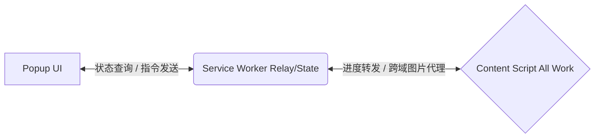
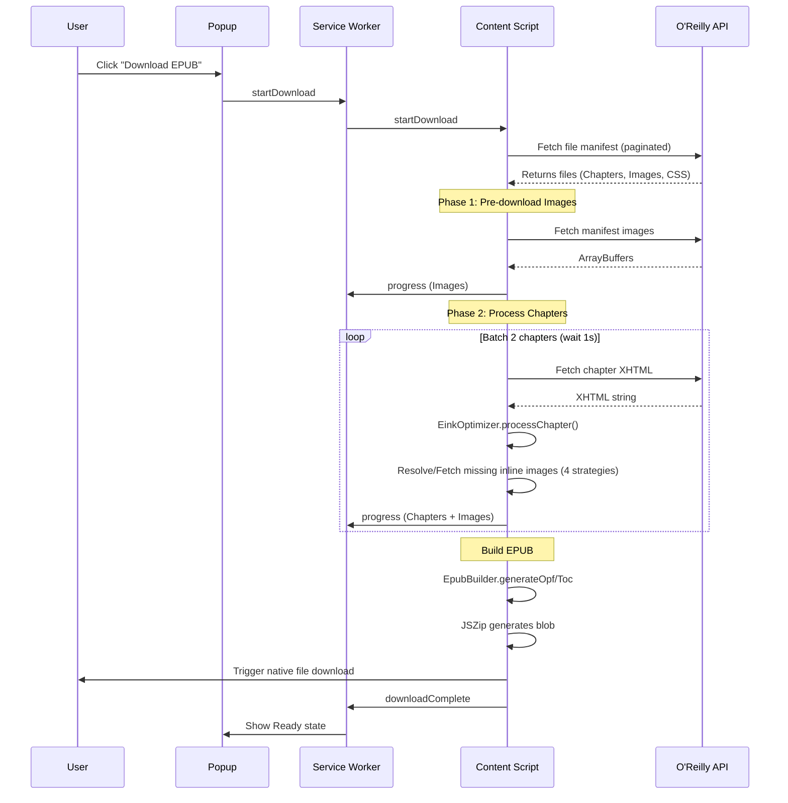

# O'Reilly EPUB 扩展项目规格说明

## 1. 项目概述
本项目是一个基于 Chrome Extension Manifest V3 (MV3) 的浏览器扩展程序。其主要功能是将在 [O'Reilly Learning](https://learning.oreilly.com) 平台上阅读的书籍，通过一键操作转换为专门针对电子墨水屏（E-ink，如 Boox）优化的 EPUB 3.0 格式文件。该扩展完全在浏览器端运行，直接利用用户现有的 O'Reilly 登录会话（Session）获取书籍数据，无需任何后端服务器支持。

## 2. 系统架构
扩展程序采用了典型的三层通信模型：



- **Popup (弹出界面)**: 纯 UI 层 (`popup.html`/`js`/`css`)。负责向 Service Worker 查询当前状态、展示书籍信息及下载进度，并发送开始、取消下载等用户指令。
- **Service Worker (后台脚本)**: 数据中继与状态管理层 (`background.js`)。负责在 Popup 和 Content Script 之间转发消息、更新扩展图标徽章（Badge），以及利用 `chrome.storage.session` 持久化状态，防止 MV3 的 Service Worker 在空闲时被终止导致状态丢失。此外，它还作为跨域资源代理（CORS proxy），用于获取在 Content Script 中受同源策略限制的 CDN 图片。
- **Content Script (内容脚本)**: 核心工作层 (`content.js`)。注入到 `learning.oreilly.com` 页面运行，执行所有的网络请求、数据解析和 EPUB 组装工作。得益于同源环境，调用 O'Reilly API 时的认证 Cookie 会被自动携带。

## 3. 核心模块说明
所有功能模块均作为 Content Script 注入页面，不使用 ES Modules，而是通过暴露全局对象的方式实现。**加载顺序**严格要求，`fetcher.js` 必须在依赖其功能的模块前加载。

- **`lib/fetcher.js`**: 负责处理 HTTP 网络请求，内置重试与渐进式退避（Progressive backoff）机制，有效处理 403 和 429 速率限制（Rate limiting）错误。同时提供 HTML/XHTML 解析器 (`parseXhtml`)、URL 查询参数及哈希清理 (`stripQueryAndHash`)，以及从页面或 CSS 中提取和去重图片链接的工具函数 (`extractImageUrls`, `extractCssImageUrls`)。
- **`lib/epub-builder.js`**: 负责生成 EPUB 所需的各类结构性文件，包括 `content.opf`（包清单）、`toc.xhtml`（EPUB 3 导航）、`toc.ncx`（为老式阅读器提供的 EPUB 2 导航）、`container.xml` 以及封面 `cover.xhtml`。该模块纯粹进行字符串拼接生成，无任何副作用。
- **`lib/eink-optimizer.js`**: 通过 DOM 操作实现针对电子墨水屏的章节内容优化（利用 `DOMParser` 和 `XMLSerializer`）。它注入专用的 E-ink CSS，将图片路径重映射为相对路径 `../Images/`，并将 CSS 链接重写为 `../Styles/`，最后利用 `XMLSerializer` 序列化回字符串以避免 HTML 实体转义引发的错误。
- **`lib/jszip.min.js`**: 第三方依赖库，用于最终将所有获取及生成的资源打包生成标准的 EPUB (ZIP) 文件。

## 4. API 接口
扩展程序在 Content Script 环境中主要调用了以下 O'Reilly 官方 API 接口：

1. **书籍元数据获取**:
   `GET /api/v2/search/?query={ISBN}&limit=1`
   用于获取书籍的标题 (Title) 和作者 (Authors) 等元数据。

2. **文件清单获取 (支持分页)**:
   `GET /api/v2/epubs/urn:orm:book:{ISBN}/files/?limit=200`
   获取构成书籍的所有文件列表。若文件过多会通过响应中的 `next` 字段进行分页加载。

3. **单个文件内容获取**:
   `GET /api/v2/epubs/urn:orm:book:{ISBN}/files/{path}`
   基于文件清单中的 `path`，下载具体的章节 HTML、CSS 和图片。

## 5. 关键实现细节
- **元数据来源**: 书籍元数据完全来自于 Search API，而非不稳定的 DOM 抓取。这是因为 O'Reilly 网站是一个 React SPA 应用，DOM 元素异步渲染且结构经常变动。同时，若 API 失败，将采用解析 `document.title` 的方式作为回退策略。
- **双阶段下载与进度条**:
  - 第一阶段 (进度 0-30%): 预下载文件清单中的所有图片。
  - 第二阶段 (进度 30-100%): 批量获取章节 HTML 并进行处理。这确保了在整个下载过程中，进度条保持平滑前进。
- **四重图片回退策略**:
  由于章节内的图片引用路径可能存在不规范，系统设计了四层递进的匹配和下载策略：
  1. 将解析后的路径与第一阶段预下载的文件清单图片进行全路径匹配。
  2. 仅依据文件名 (`filename`) 进行模糊匹配。
  3. 通过 O'Reilly API 请求相对路径的图片。
  4. 对于绝对路径的 CDN 图片，通过 Service Worker 进行代理请求以绕过 CORS 限制。
- **CSS 背景图片处理**: 通过正则表达式从 CSS 文件中提取 `url()` 引用的背景图片，并一并下载并替换为本地路径。
- **速率限制处理 (Rate Limiting)**: O'Reilly API 容易触发 403 或 429 速率限制错误。下载章节时采用每次获取 2 个章节，并在批次之间主动延迟 1 秒的限流措施。
- **MV3 状态持久化**: 利用 `chrome.storage.session`，即使在 Service Worker 因空闲（约 30 秒）被 Chrome 强制挂起重启后，依然能够恢复下载进度、状态信息，保证 Popup 显示正常。
- **EPUB 规范与兼容性**: `mimetype` 文件被强制设为 ZIP 归档中的第一个文件，且压缩级别为 `STORE`（不压缩）。同时生成 EPUB 3 (`toc.xhtml`) 与 EPUB 2 (`toc.ncx`) 的目录，以保证最大程度的阅读器兼容性（如部分 Boox 设备）。

## 6. 数据流程图
以下是完整的下载及处理流程：



## 7. 技术约束
- **Vanilla JS (原生 JavaScript)**: 不使用 React/Vue 等框架，不依赖 Webpack/Vite 等构建工具，纯手工编写，方便调试。
- **IIFE Pattern**: 所有的逻辑代码均包裹在立即执行函数表达式 (IIFE) 中 `(function() { 'use strict'; ... })()`，防止污染全局作用域。
- **全局对象模块化**: 不使用 ES Module (`import`/`export`) 语法。各模块通过在 `window` 环境下挂载全局常量（如 `const Fetcher = { ... }`）进行交互，以此兼容最简单的 Chrome Extension 内容脚本注入机制。

## 8. 文件结构
```text
oreilly-epub-extension/
├── manifest.json          # Chrome Extension Manifest V3 配置文件
├── content.js             # 核心工作脚本（获取数据、解析和组装 EPUB）
├── background.js          # Service worker 脚本（状态保持，CORS 代理，徽章更新）
├── popup.html             # Popup 面板 HTML
├── popup.js               # Popup 面板交互逻辑
├── popup.css              # Popup 面板样式
├── lib/                   # 第三方与核心模块库（注意加载顺序）
│   ├── jszip.min.js       # 第三方 ZIP 打包库
│   ├── fetcher.js         # HTTP 请求、重试限流策略与 URL/XHTML 工具
│   ├── epub-builder.js    # EPUB 结构文件生成器
│   └── eink-optimizer.js  # 电子墨水屏样式优化与 HTML 重写器
├── styles/
│   └── eink-override.css  # 针对墨水屏的代码块优化样式（打包进 EPUB 中）
├── icons/                 # 扩展程序不同分辨率图标
└── tests/                 # 基于浏览器的简易测试环境
```
